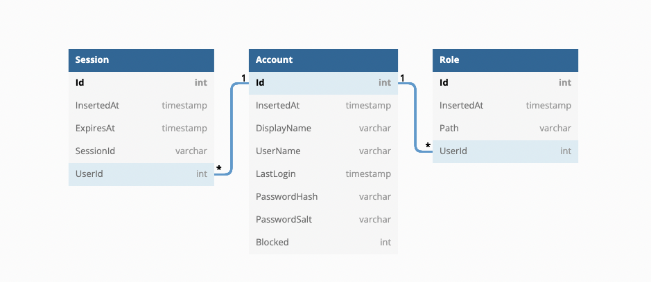

# auth-sample
An .net 5 web api example project for header authentication and resource based authorization  


> This project demonstrates how to setup an .net core web project with resource based authorization

## Project Overview
- This application has 3 controllers: Admin, Auth and WeatherForecast
- In AuthController you can register and login 
- In WeatherForecastController you can see Weather Forecast
- In AdminController you can make some user admin and reset a user password

### Identify problem 
Every user can login and register but every user cannot reset a user password. Only admin users can.  
Admin user is basically who has access to AdminController.  
But we need to prevent to access to AdminController a user who has not access to AdminController.  
To do that we need to identify first who wants to access.  

To identify user, user needs to send something what we know. That thing (a key or token or ticket) provides authentication.  
We provide this key with login method. User takes this key from login and sends that key in request header to use other resources.  
To login, user needs to be registered. With `/auth/register` method, we store that user in Account table.
User sends username, password and display name to `/auth/register` method.  
> And we hash password with a 128-bit salt using a cryptographically strong random sequence of nonzero values. With salt, passwords cannot revert from hash using a rainbow table. Also using unique salt per user, hacker needs to calculate a new rainbow table for each user password. That makes harder crack password.  

In `/auth/login` method, we check username and password. If credentials are correct, we generate a key for user can access other resources.
We store the generated key and when it expires in `Session` table. With that, when user sends a request with that key, we can find out which user is this.  
To identify that, user needs to send this key on header with `Authorization` key.  
Also we can find out resource that user wants to access from request.  
So we have user and resource. To find out can user access that resource, we can control the `Role` table. When a user registered, we grant to access to WeatherForecast by inserting into `Role` table. 

So we have db schema:  

  

### Now code time  
We need to create an `Attribute`. It needs to be implemeneted to `IAuthorizationFilter` to check authorization before method executed.

````csharp
[AttributeUsage(AttributeTargets.Class | AttributeTargets.Method)]
public class HeaderAuthorizeAttribute : Attribute, IAuthorizationFilter
````

We used `AttributeUsage` to use this custom attribute on a method or a class. `IAuthorizationFilter` requeires to implement `OnAuthorization` method.

````csharp
[AttributeUsage(AttributeTargets.Class | AttributeTargets.Method)]
public class HeaderAuthorizeAttribute : Attribute, IAuthorizationFilter
{
    public void OnAuthorization(AuthorizationFilterContext context)
    {
        var token = context.HttpContext.Request.Headers["Authorization"]
                        .FirstOrDefault()?
                        .Split(" ")
                        .Last();
        if (token is null)
        {
            context.Result = new UnauthorizedResult();
        }
    }
}
````

In here context provides `Request` object and `Request` object provides us request headers and resource path to access. 
So we have token and resource. But we need check from db. To do that we can get `AuthService` :

````csharp
public void OnAuthorization(AuthorizationFilterContext context)
{
    IAuthService authService = (IAuthService)context.HttpContext.RequestServices.GetService(typeof(IAuthService));
    
    //...
````

With `AuthService` we can check 'is token valid', 'which user is this' and 'does that user have acces the resource'.

````csharp
[AttributeUsage(AttributeTargets.Class | AttributeTargets.Method)]
public class HeaderAuthorizeAttribute : Attribute, IAuthorizationFilter
{
    public void OnAuthorization(AuthorizationFilterContext context)
    {
        IAuthService authService = (IAuthService)context.HttpContext.RequestServices.GetService(typeof(IAuthService));

        var token = context.HttpContext.Request.Headers["Authorization"].FirstOrDefault()?.Split(" ").Last();
        if (token is null)
        {
            context.Result = new UnauthorizedResult();
        }

        try
        {
            var doesHavePermission = authService.DoesHavePermission(token,context.HttpContext.Request.Path);
            if (doesHavePermission)
            {
                context.Result = new UnauthorizedResult();
            }
        }
        catch (Exception ex)
        {
            System.Diagnostics.Debug.WriteLine("Header authorize resolve error: " + ex.Message);
            context.Result = new UnauthorizedResult();
        }
    }
}
````

Now we have fully functional customized authorize attribute. We can use that attribute on controllers like this: 

````csharp
[ApiController]
[Route("[controller]")]
[HeaderAuthorize]
public class AdminController : ControllerBase
````
and 
````csharp
[ApiController]
[Route("[controller]")]
[HeaderAuthorize]
public class WeatherForecastController : ControllerBase
````

With this way, when a user wants to access `/admin/something`, attribute will check 'does that user have access to `/admin/something`'.

